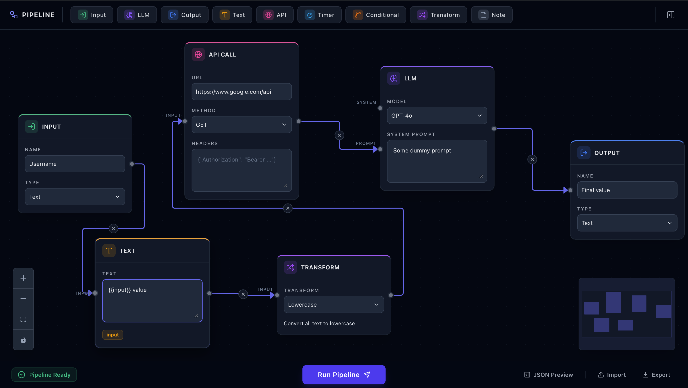
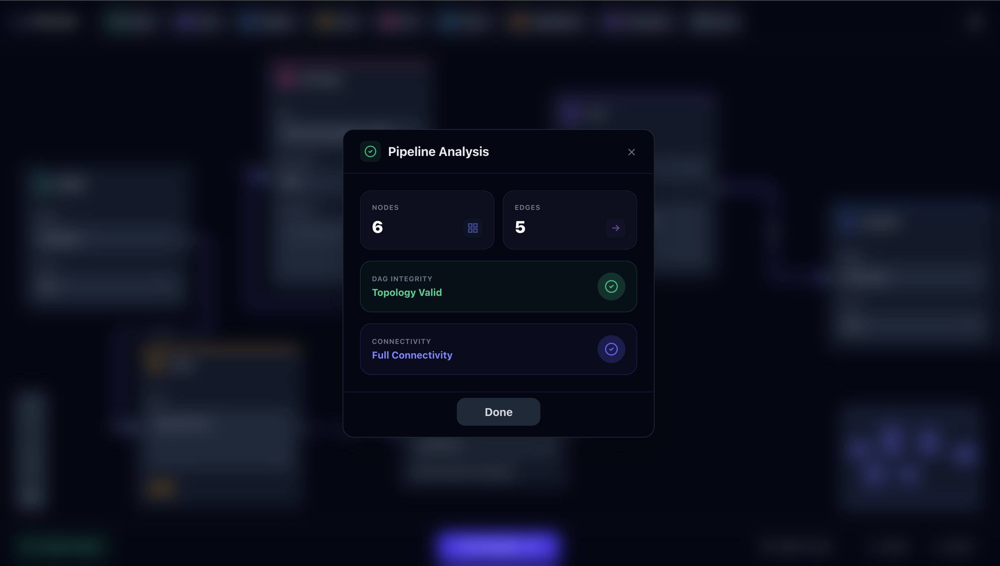
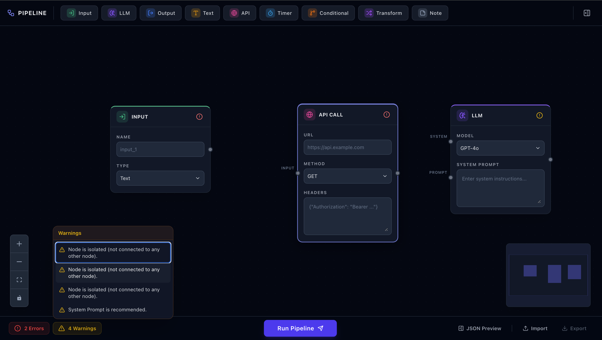
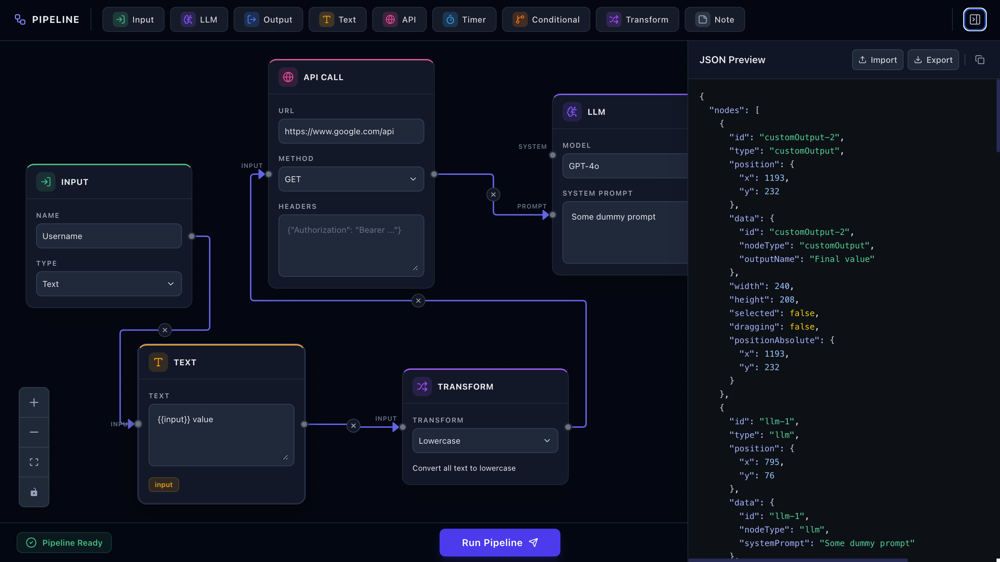
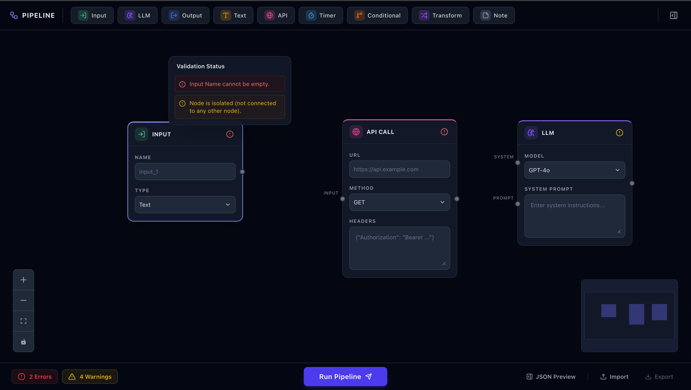
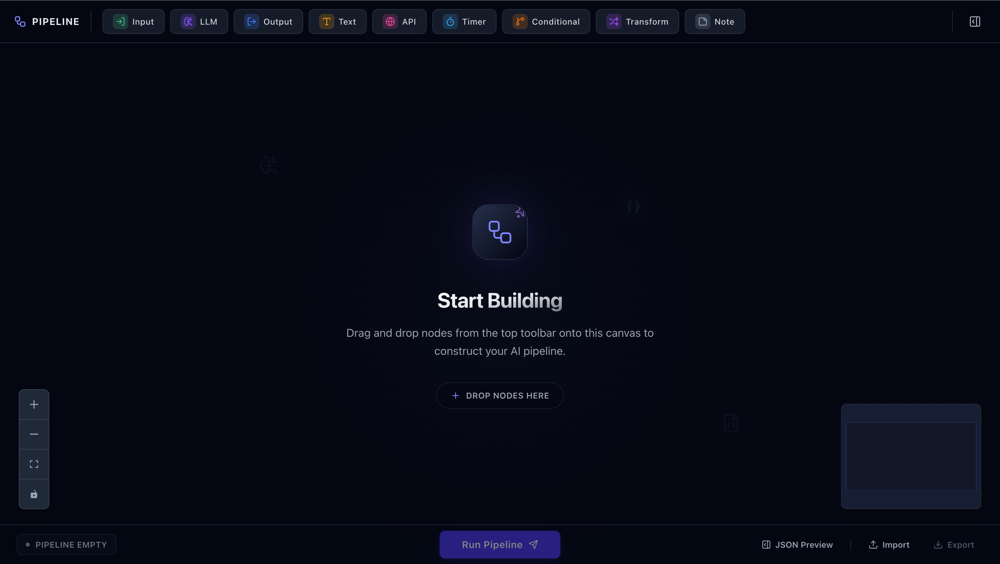

# VectorShift Pipeline Builder 🚀

A pipeline builder UI. This application allows users to design complex workflows using a drag-and-drop interface, featuring custom node abstractions, dynamic text logic, and backend DAG validation.

## 📸 Demo & Screenshots

### 1. Core Interface & Node Builder


### 2. Intelligent Pipeline Validation


### 3. Real-time Node Status & Highlighting


### 4. Resizable JSON Data Preview


### 5. Advanced Error Handling


### 6. Clean Empty State



## ✨ Key Features

- **Premium UI/UX**: Built with **HeroUI** (NextUI) featuring glassmorphism, dark mode, and smooth micro-animations.
- **Node Abstraction**: Composable `BaseNode` architecture for rapid creation of specialized nodes.
- **Dynamic Text Nodes**:
  - **Auto-resizing**: Text areas grow/shrink dynamically with content.
  - **Variable Handles**: Automatically generates input handles for `{{ variable }}` patterns.
- **Backend Validation**:
  - **DAG Detection**: Backend verifies if the pipeline is a Directed Acyclic Graph (no loops).
  - **Connectivity Check**: Ensures all nodes are interconnected for a functional pipeline.
- **Custom Edges**: Deletable edges with built-in 'X' buttons for clean graph management.
- **JSON Preview**: Real-time view of the pipeline data in a resizable sidebar.
- **Import/Export**: Easily save and load pipelines as JSON files.

## 🛠️ Tech Stack

### Frontend
- **Framework**: [React 18](https://reactjs.org/) (Vite)
- **Canvas**: [ReactFlow v11](https://reactflow.dev/)
- **Styling**: [Tailwind CSS](https://tailwindcss.com/) + [HeroUI](https://heroui.com/)
- **Icons**: [Lucide React](https://lucide.dev/)
- **State Management**: [Zustand](https://github.com/pmndrs/zustand)

### Backend
- **Framework**: [FastAPI](https://fastapi.tiangolo.com/) (Python 3)
- **Validation**: Kahn's Algorithm for DAG detection.
- **Server**: Uvicorn with Hot Reload.

## 📁 Project Structure

```
.
├── screenshots/            # Official project captures
│   ├── home_complete_view.png
│   ├── submit_data_view.png
│   ├── warning_and_highlighting_node.png
│   ├── json_preview.png
│   ├── error_popover_view.png
│   └── empty_view.png
├── frontend/               # React application (Vite-based)
│   ├── src/
│   │   ├── components/     # High-fidelity UI components
│   │   │   ├── Canvas/     # Canvas, EmptyState, DeletableEdge
│   │   │   ├── FooterArea/ # ActionButtons, AnalysisModal, FooterArea
│   │   │   ├── Sidebar/    # JSON Preview Sidebar
│   │   │   ├── Toolbar/    # Node Toolbar and logic
│   │   │   └── UI/         # Reusable Field, Icon, and Label components
│   │   ├── nodes/          # BaseNode abstraction & 9 specialized nodes
│   │   ├── constants/      # Node Config and Form Options
│   │   ├── store/          # Zustand global state (useStore.js)
│   │   ├── utils/          # Validation logic and regex helpers
│   │   ├── App.jsx         # Root layout
│   │   ├── submit.jsx      # Specialized Submit component
│   │   └── index.css       # Core Design System & Tokens
├── backend/                # FastAPI application
│   ├── main.py             # DAG & Connectivity analysis logic
│   ├── requirements.txt    # Python dependencies
│   └── venv/               # Project virtual environment
├── rule.md                 # Project architecture & standards
└── README.md               # Documentation
```

## 🚀 Getting Started

### 1. Prerequisites
- Node.js (v16+)
- Python 3.10+

### 2. Frontend Setup
```bash
cd frontend
npm install
npm run dev
```
The app will be available at `http://localhost:3000`.

### 3. Backend Setup
```bash
cd backend
python3 -m venv venv
source venv/bin/activate
pip install -r requirements.txt  # Or manually install fastapi uvicorn
uvicorn main:app --reload --port 8000
```
The backend will run at `http://localhost:8000`.
